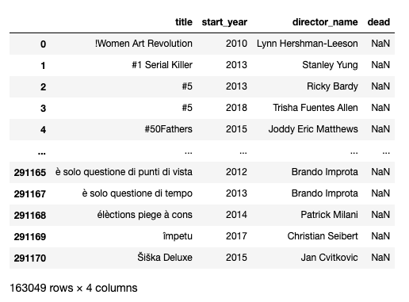
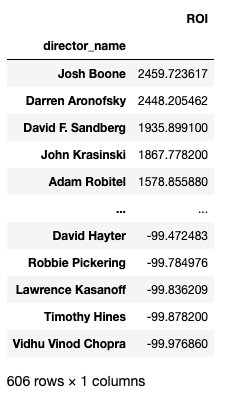
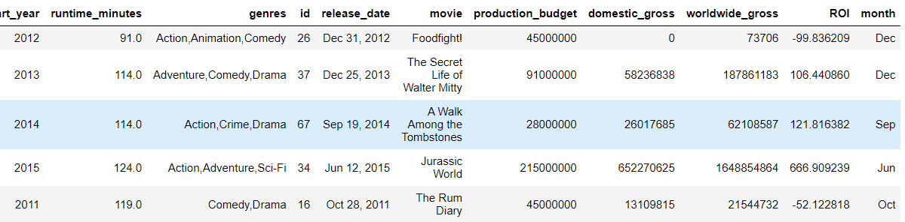
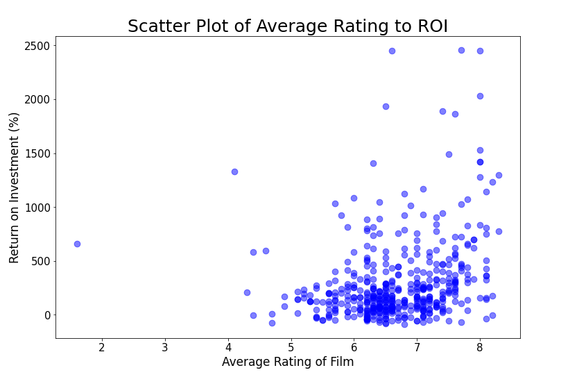

# Phase 1 - Project #1 - Microsoft Studios Proposal

## Project Team: 
 - [**Ilene Sorto**](https://github.com/ileneee)
 - [**Soo Ho (John) Park**](https://github.com/soohojp)
 - [**Nicholas Wertz**](https://github.com/njw27)

## Navigating the Repository
All data used in this project can be found in the file [`master_dataset_final.ipynb`](https://github.com/soohojp/Phase-1-Project-Best-Team-/blob/main/master_dataset.ipynb). 
Each individual goal was coded separately and can be found in the [`goal_notebook/`](https://github.com/soohojp/Phase-1-Project-Best-Team-/tree/main/goal_notebook) directory. Duties were divided as follows: John for [Goal 1](https://github.com/soohojp/Phase-1-Project-Best-Team-/blob/main/goal_notebook/goal_1_john.ipynb), Nick for [Goal 2](https://github.com/soohojp/Phase-1-Project-Best-Team-/blob/main/goal_notebook/goal_2_nick_w.ipynb), and Ilene for [Goal 3](https://github.com/soohojp/Phase-1-Project-Best-Team-/blob/main/goal_notebook/Data%20set%20cleaning%20-%20ilene.ipynb). These separate files were then joined into the [`master_dataset_final.ipynb`](https://github.com/soohojp/Phase-1-Project-Best-Team-/blob/main/master_dataset_final.ipynb). All images used in this README.md can be found in the [`pictures/`](https://github.com/soohojp/Phase-1-Project-Best-Team-/tree/main/pictures) folder seperated by who utilized them for which goal. 

### [**Google Slides Presentation**](https://docs.google.com/presentation/d/1lji_D2xxVe0zyIKBb3xj-NbBtchKtJVsNWZ2Hw34yL4/edit?usp=sharing)

# Resources
The datasets used were too large to upload to this GitHub repo, but were sourced from [**IMDB**](https://www.imdb.com/) and [**The Numbers**](https://www.the-numbers.com/). IMDB provided the movie titles, staff, and release information and The Numbers was primarily used for financial information. 

# Introduction

As an up-and-coming studio, Microsoft Studio may be questioning as to whether or not it should invest huge sums of money into the film industry. Our data analysis of databases on film information can assess the risk and measure the potential return of entering the field. With our keen focus on the average return on investment, we pinpoint what genres, directors/writers, and release timeframe would yield the highest returns.

# Master Data Filtering and Cleaning

After identifying the data sets needed by all members of our team, we first cleaned the `tn.movie_budgets.csv.gz` by converting it to a Pandas DataFrame and stripping all punctuation from the columns related to finance. All items in these columns were then converted to . A new column was created in the DataFrame called "ROI" in which the return on investment was calculated using the following equation:

#### **100 * (worldwide_gross - budget)/(worldwide_gross)**

Yet another column was then added named "start_year" in order to help with joining the DataFrame in later steps. Finally, all rows where worldwide gross was zero were eliminated from the data.

Next a connection was established to the unzipped `im.db` file and a curser was created. The master data set required us to select all columns from the `movie_basics` table which were put into a new DataFrame. This DataFrame was then joined with the `tn_movie` DataFrame above and joined into a new DataFrame named `imdb_basics`.

# Goal 1 - 
## Return on Investment by Genre

The first step was to drop rows with undefined genres from the dataframe `imdb_basics` before we categorized each film by genre.

As shown above, many films are categorized under more than one genres. For example, `'Foodfight!'` is in three genres, which are `'Action, Animation, Comedy'`.

One major consideration we had to make was whether we should retain the combination of genres as a distinct category or include it into each of the genres. In other words, should we make a new genre called `'Action, Animation, Comedy'` or place `'Foodfight!'` into the `'Action'` genre, `'Animation'` genre, and `'Comedy'` genre?

The former would offer more nuanced data as to which specific combination of genres would be the most profitable, yet the data frame would then account for too many genres, making it confusing and inaccessible to the audience.

Thus, we've decided to place films into each of genres separately.

The second step was to make a list of unique genres to see how many distinct genres there are.

Next, `imdb_basics` dataframe was translated into variables, which categorizes films by unique genres. Since values under the `'genres'` column in `imdb_basics` are strings, inputting the genre name into the `.str.contains()` method will filter data by genre. Then, by using `.ROI.mean()` on each of the variables, we created a list called `genre_roi_mean` that contains the mean of the ROI by genre.

After data wranggling, we now have the list of unique genres and the average ROI for those genres respectively. Instead of placing the data onto a bar graph directly, we created a new dataframe `genreroidf` to order it based on highest to lowest ROI mean values.

As shown above, this bar graph shows the mean of return on investment for each of the genres. `'Horror'`, `'Mystery'`, and `'Thriller'` appear to yield the highest average return on investment, while `'War'`, `'Western'`, and `'Sports'` yield the lowest. This data visualization can help identify which genres can have a lower risk from the point of view as an investor.

## Size of Market by Genre

Finding the mean return on investment is important in selecting what genres to film, especially as an up-and-coming studio. However, another significant factor to consider is the size of the market - how much total profit was made in each genre. This can help determine where the money lies.

To find the sum of profits of all films in each genre, we used the method `.sum()` on the variables that categorized the data by genre.

The list of unique genres from above and the sum of profits of all films were placed into a new dataframe called `'genretotalprofitdf'`, which organized genres from highest to lowest total profit. Using this dataframe, we formulated a bar graph.

As this bar graph indicates, `'Action'`, `'Adventure'`, and `'Comedy'` are the biggest markets in terms of profit, while `'War'`, `'Western'`, `'Sport'`, and `'Documentary'` yield the lowest profits. This visualization can provide a general sense of which genres attract the most profit, therefore the size of the market.

## Saturation of the Market
Yes, the total profit of all films in each genre helps us understand the size of the market, but to gain a deeper understanding about the market, we must also consider its saturation. So, how many films are exactly in each of the genres? 

The list of unique genres from above and number of films in each genre were placed into a new dataframe called `genrenumdf`, which organizes genres by their number of films in descending order. This new dataframe was used to formulate a bar graph.

As this bar graph indicates, `'Drama'`, `'Comedy'`, and `'Action'` have a higher number of films, while `'War'`, `'Western'`, and `'Musical'` have a lower number of films. This visualization not only shows the size of the market based on genre, but also suggests how much competition is in each market.

## Average Profit of a Film in Each Genre

Combining the information on total profit and the number of films in each genre, we can find the average profit of a film in each genre. This allows us to consider which genres could yield the highest profit.

The list of unique genres from above and the mean profit of films in each genre were placed into a new dataframe called `genreaveprofitdf`, which organizes genres from the highest average profit to the lowest. This new dataframe was then used to formulate a bar graph.

As this bar graph indicates, films that are Animation, Musical, Sci-Fi, and Adventure have a high average profit, while films that are War, Sport, and Documentary have a low average profit.

One can gain a deeper understanding about the relationship between genre and profitability by synthesizing the graphs on average ROIs by genre, total profit by genre, number of films in genre, and average profit of film by genre.

The graph on average ROIs by genre indicate that Horror, Mystery, and Thriller have a higher average ROI, suggesting a lower risk in investment than other genres. However, the markets for the aforementioned genres are actually small compared to more saturated genres with higher attraction of money like Action and Adventure. This means that the pure profit from genres like Horror, Mystery, and Thriller may not be that high, but with lower competition in the genre and a higher average ROI, there may be lower risk and an opportunity to enter a niche market.

On all four metrics, War, Western, Sport, and Documentary genres are likely to not only yield low average profits, but also have low returns on investment. Microsoft Studios should be cautious to involve themselves in these types of genres.

# Goal 2 - Writer and Director Profitability

## Return on Investment for Directors

The first step was joining our `movie_basics` table to our directors and persons tables and then convert the newly created SQL table to a Pandas DataFrame.

Next, we merged our directors DataFrame to the `imdb_basics` DataFrame we created as part of our master data set. We performed an inner join to keep only the films with the same title that also shared  start years. We joined on two columns in order to avoid false joins where different films have the same title.

This data left a lot to be desired, as we had deceased directors, incredibly small budgeted films, and extremely high budgeted films in our data. This was cleaned, eliminating directors that had passed at the time of this data's collection. The data was also constrained to a minimum budget of 10 million dollars and a maximum of 65 million dollars, based on the budget data's 25th and 75th percentiles, respectively. Given the client, this range is ideal as 10 million dollars is an extremely conservative film budget and not much for them to spend. 65 million dollars seems to be a good maximum, as they are establishing a new studio and do should not spend all potential capital on one or two films. These constraints will find a director who is comfortable working in this budget range and returning a profit.

After additional filtering, we now have a DataFrame of all films, their ROI, and their director. As every director has directed films of various budgets, the mean of all ROI was calculated for each director. The results were then listed in descending order and finally the top 20 directors on this list were placed on a bar graph.

As can be seen, our data filtering has yielded the client with a list of  directors with the top 20 ROI. It includes notable directors such as Darren Aronofsky, James Wan, Jordan Peele and M. Night Shyamalan. This graph of the top 20 will be presented to the client as well as the full list upon request. However, this is still 20 choices, which may be overwhelming to the client. This will be further filtered after we create a list of writers with the top ROI.

## Return on Investment for Writers

The first step was joining our imdb_basics table to our writers and persons tables and then convert the newly SQL table to a Pandas DataFrame.

Next, we merged our DataFrame that connected movies to writers to the `imdb_basics` DataFrame we created as part of our master data set. An inner join was performed in order to keep only the films with the same title that also shared  start years. We joined on two columns in order to avoid false joins where different films have the same title.

This was cleaned according to the guidelines we followed in directors. All deceased writers were eliminated from the new DataFrame and the budget was yet again constrained to the 25th and 75th percentiles (10 million dollars to 65 million dollars).

After additional filtering, we now have a DataFrame of all films, their ROI, and their writers. The mean of each writers ROIs were calculated. The results were then listed in descending order and graphed.

As can be seen, our data filtering has descending the client with a list of writers with the top 20 ROIs. Notable individuals on the list include: David Gordon Green, Cary Fukunaga, and John Krasinski. This graph of the top 20 will be presented to the client as well as the full list upon request. We still have many writers to choose from and we need to match them to a director. 

However, it would be much simpler to get a writer who is also a director, to save the trouble of having to mach the two roles. It also introduces potential cost savings in streamlining production, as you would only need pay the director slightly more to do the work of two people, rather than paying two separate people full salaries.

## Who can both direct and write and still deliver the highest return on investment?

First we will join our director and writer DataFrames.

Then we will filter our DataFrame to only rows where the writer and director are the same and return a list of mean ROI by director in descending order. We will limit our results to the top 5 individuals to give the client a clearer, less overwhelming choice.

This list can then be turned into a bar graph, showing the director/writers that yield the highest return on investment for mid-tier budgeted films. 

### **From this data, we would recommend that our client hires the  writer/director with the highest average return on investment, David Gordon Green. The primary genres he works in are horror and thrillers.**

# Goal 3

## Finding the best season to release a movie with the 3 genres
After combining the tables above the first step is to drop rows with none genres,
ideally dropping rows isn't the best solution but we found that there is not replacement for it like there would be for numeric rows.

Now that the genre column is clean, we need to establish a certain time frame to calculate which months from which years that we want and we chose 2012 to 2010. Which is dropped from my very own data set not to disturb anyone else's.

Since I only need months I decided to add a new column for it as you see above from the release date column but only grabbing the abbreviated from the date format. 
After  having all that together it's time to calculate the ROI using the column in the data table we added for our convenience. 

Now to get the results that we want we use the two columns and find the average with mean for all the months and create a new variable with all the months of the year so that it could graph correctly.

After graphing the data we found the best time to release a movie with our chosen genres is overwhelming July which the best season being summer. 

# Conclusion

Our data analysis based on the metric, return on investment, demonstrates that Microsoft Studio should release mystery, thriller, and horror films in July with directors who can also write scripts like the likes of David Gordon Green, Damien Chazelle, John Krasinski, Jordan Peele, and M. Night Shyamalan. Hiring those who can serve as both the director and writer can drastically reduce the production budget, therefore resulting in a higher yield. Our recommendation offers a low risk, low cost approach targetting  a less competitive, niche genre. Especially for a newly developing studio, like Microsoft Studio, this type of approach can set the groundworks for bigger ventures in the future.

# Future Improvements 
#### Look into the ROI for actors/actresses to help narrow down casting
#### Narrow down writers by region/language to get even more relevant results
#### Figure out if runtime affects profitability 
#### Track if a directors ROI can be predicted through modeling (ex. If certain director is given budget X, the ROI will most likely be in Y range
#### Create a program that you can enter one or more of several variables, and will output ideal director/writer/time of release/etc. based on input
#### Gather/find new information regarding the marketing budget and its relationship to total gross and ROI

# Appendix: 

## **Is critical reception correlated to ROI? Worldwide Gross? Domestic Gross?**

A new dataframe was created from the `movie_ratings` and `movie_basics` SQL tables and joined to `imdb_basics`. The results were then filtered to only films with 50,000 or more votes to prevent skewed data from films with a low number of votes. The same budget constraints were put on this data as in Goal #2 for consistency.

The Pearson correlations were then found for the rating vs ROI, worldwide gross, and domestic gross.

#### So there is a positive correlation between critical rating and ROI/Worldwide gross/domestic gross but its not a high/significant result. We will graph the relationship with the highest correlation as a scatter plot to look at this information visually.

