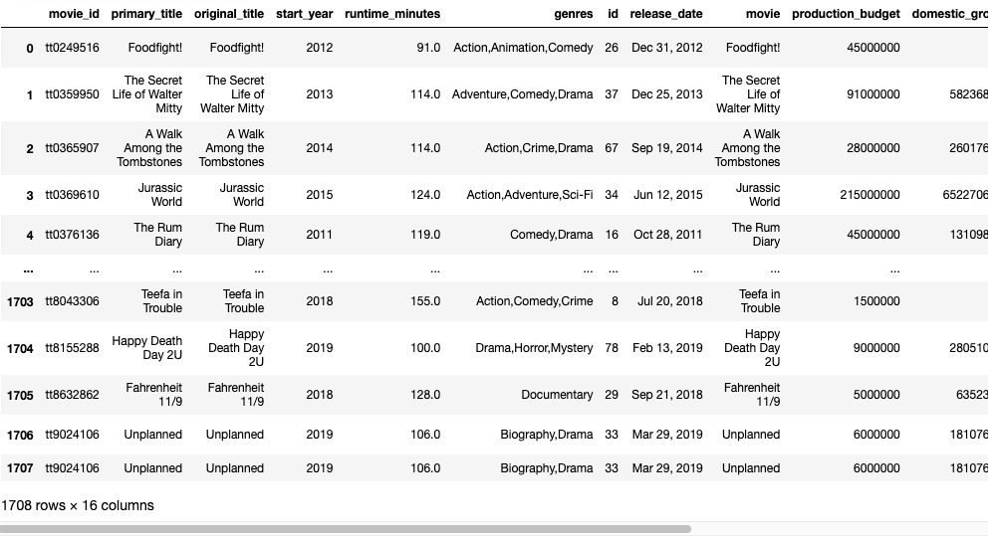
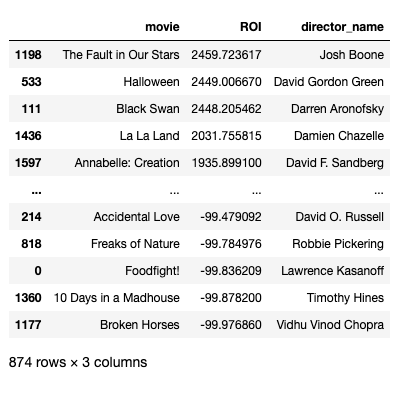
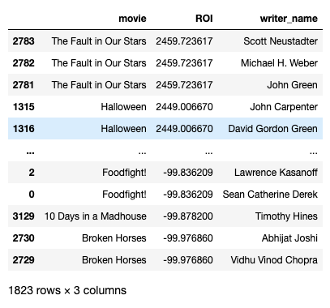
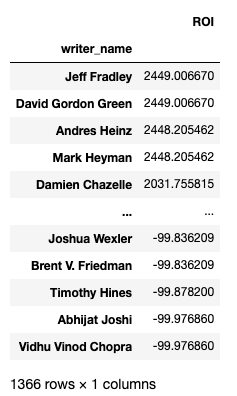
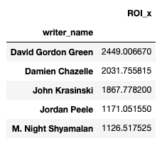

# Phase-1-Project-Best-Team-

## Master Data Filtering and Cleaning

After identifying the data sets needed by all members of our team, we first cleaned the `tn.movie_budgets.csv.gz` by converting it to a Pandas DataFrame and stripping all punctuation from the columns related to finance. All items in these columns were then converted to . A new column was created in the DataFrame called "ROI" in which the return on investment was calculated using the following equation:

#### **100 * (worldwide_gross - budget)/(worldwide_gross)**

Yet another column was then added named "start_year" in order to help with joining the DataFrame in later steps. Finally, all rows where worldwide gross was zero were eliminated from the data.

Next a connection was established to the unzipped `im.db` file and a curser was created. The master data set required us to select all columns from the `movie_basics` table which were put into a new DataFrame. This DataFrame was then joined with the `tn_movie` DataFrame above and joined into a new DataFrame named `imdb_basics`.

# Goal 1 - 

# Goal 2 - Writer and Director Profitablity

## Return on Investment for Directors

The first step was joining our `movie_basics` table to our directors and persons tables and then convert the newly created SQL table to a Pandas DataFrame.

Next, we merged our diectors DataFrame to the `imdb_basics` DataFrame we created as part of our master data set. We perfomed an inner join to keep only the films with the same title that also shared  start years. We joined on two columns in order to avoid false joins where different films have the same title.

This data left a lot to be desired, as we had deceased directors, incredibly small budgeted films, and extemely high budgeted films in our data. This was cleaned, eliminating directors that had passed at the time of this data's collection. The data was also constrained to a minimum budget of 10 million dollars and a maximum of 65 million dollars, based on the budget data's 25th and 75th percentiles, respectively. Given the client, this range is ideal as 10 million dollars is an extremely conservative film budget and not much for them to spend. 65 million dollars seems to be a good maximum, as they are establishing a new studio and do should not spend all potential capital on one or two films. These constraints will find a director who is comfortable working in this budget range and returning a profit.

After additional filtering, we now have a DataFrame of all films, their ROI, and their director. As every director has directed films of various budgets, the mean of all ROI was calculated for each director. The results were then listed in decending order and finally the top 20 directors on this list were placed on a bar graph.

As can be seen, our data filtering has yeilded the client with a list of  directors with the top 20 ROI. It includes notable directors such as Darren Aronofsky, James Wan, Jordan Peele and M. Night Shyamalan. This graph of the top 20 will be presented to the client as well as the full list upon request. However, this is still 20 choices, which may be overwhelming to the client. This will be further filtered after we create a list of writers with the top ROI.

## Return on Investment for Writers

The first step was joining our imdb_basics table to our writers and persons tables and then convert the newly SQL table to a Pandas DataFrame.

Next, we merged our DataFrame that connected movies to writers to the `imdb_basics` DataFrame we created as part of our master data set. An inner join was performed in order to keep only the films with the same title that also shared  start years. We joined on two columns in order to avoid false joins where different films have the same title.

This was cleaned accoring to the guidelines we followed in directors. All deceased writers were eliminated from the new DataFrame and the budget was yet again constrained to the 25th and 75th percentiles (10 million dollars to 65 million dollars).

After additional filtering, we now have a DataFrame of all films, their ROI, and their writers. The mean of each writers ROIs were calculated. The results were then listed in decending order and graphed.

As can be seen, our data filtering has yeilded the clinet with a list of writers with the top 20 ROIs. Notable individuals on the list include: David Gordon Green, Cary Fukunaga, and John Krasinski. This graph of the top 20 will be presented to the client as well as the full list upon request. We still have many writers to choose from and we need to match them to a director. 

However, it would be much simpler to get a writer who is also a director, to save the trouble of having to mach the two roles. It also introduces potential cost savings in streamlining production, as you would only need pay the director slightly more to do the work of two people, rather than paying two seperate people full salaries.

## Who can both direct and write and still deliver the highest return on investment?

First we will join our director and writer DataFrames.

Then we will filter our DataFrame to only rows where the writer and director are the same and return a list of mean ROI by director in descending order. We will limit our results to the top 5 individuals to give the client a clearer, less overwhelming choice.

This list can then be turned into a bar graph, showing the director/writers that yield the highest return on investment for mid-tier budgeted films. 

### **From this data, we would recomend that our client hires the  writer/director with the highest average return on investment, David Gordon Green. The primary genres he works in are horror and thrillers.**

# Goal 3

## Finding the best season to release a movie with the 3 genres
After combining the tables above the first step is to drop rows with none genres,
ideally dropping rows isn't the best soluntion but we found that there is not replacement for it like there would be for numeric rows.

Now that the genre column is clean, we need to establish a certain time frame to calculate which months from which years that we want and we chose 2012 to 2010. Which is dropped from my very own data set not to disturb anyone elses.

Since I only need months I decided to add a new column for it as you see above from the release date column but only grabbing the abbreviated from the date format. 
After  having all that together it's time to calculate the ROI using the column in the data table we added for our convenience. 

Now to get the results that we want we use the two columns and find the average with mean for all the months and create a new variable with all the months of the year so that it could graph correctly.

After graphing the data we found the best time to release a movie with our chosen genres is overwhelming july which the best season being summer. 

# Future Improvements 
#### Look into the ROI for actors/actresses to help narrow down casting
#### Narrow down writers by region/language to get even more relevant results
#### Figure out if runtime affects profitability 
#### Track if a directors ROI can be predicted through modeling (ex. If certain director is given budget X, the ROI will most likely be in Y range
#### Create a program that you can enter one or more of several variables, and will output ideal director/writer/time of release/etc. based on input
#### Gather/find new information reguarding the marketing budget and its relationship to total gross and ROI

# Appendix: 

## **Is critical reception correlated to ROI? Worldwide Gross? Domestic Gross?**

A new dataframe was created from the `movie_ratings` and `movie_basics` SQL tables and joind to     `imdb_basics`. The results were then filtered to only films with 50,000 or more votes to prevent skewed data from films with a low number of votes. The same budget constraints were put on this data as in Goal #2 for consistency.

The Pearson correlations were then found for the rating vs ROI, worldwide gross, anmd domestic gross.

#### So there is a positve correlation between critcal rating and ROI/Worldwide gross/domestic gross but its not a high/significant result. We will graph the relationship with the highest correlation as a scatter plot to look at this information visually.

